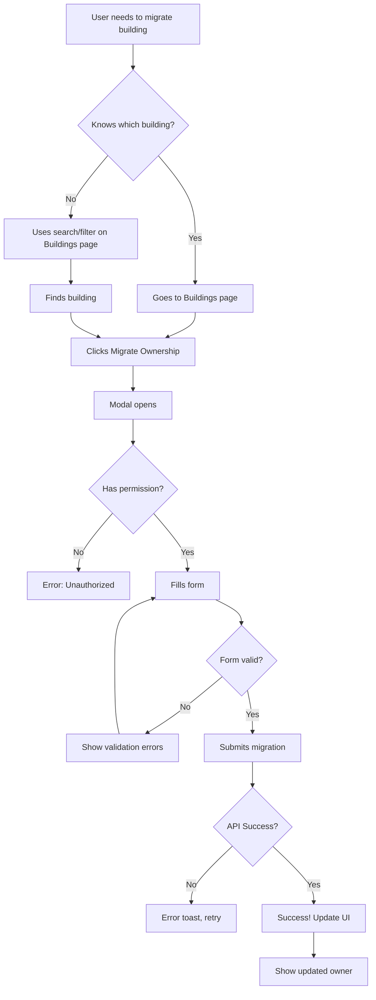

# User Flow: Building Ownership Migration

---

## 📊 Before vs After Comparison

### BEFORE (Problematic Flow)

```
User wants to migrate building ownership
    ↓
User thinks: "Where do I do this?"
    ↓
User checks Units page ❌ (not there)
    ↓
User checks Buildings... wait, there's no Buildings page ❌
    ↓
User checks Dashboard ❌ (not there)
    ↓
User gives up and asks admin or searches docs
    ↓
Eventually discovers: Settings → Organization
    ↓
Clicks through nested menus
    ↓
Finds migration buried in organization settings
    ↓
Completes migration (if they found it)

PROBLEMS:
❌ Hidden behind generic "Settings" label
❌ No clear connection to buildings domain
❌ Counterintuitive location (settings = configuration, not operations)
❌ Poor discoverability
❌ Extra navigation steps
```

### AFTER (Improved Flow)

```
User wants to migrate building ownership
    ↓
User thinks: "This is about buildings"
    ↓
User clicks "Buildings" in sidebar (clearly visible in Core group)
    ↓
User sees list of buildings
    ↓
User finds the building they want to migrate
    ↓
User clicks "Migrate Ownership" button (contextually placed on the building card)
    ↓
Modal opens with migration form
    ↓
User fills in: new owner, date, notes
    ↓
User confirms migration
    ↓
Success! Building ownership transferred

BENEFITS:
✅ Direct path: Buildings → Building Card → Migrate
✅ Contextual: action appears where user is focused
✅ Discoverable: clear label, visible location
✅ Fewer clicks: 2 steps vs 3+
✅ Mental model: "I manage buildings in the Buildings section"
```

---

## 🗺️ Detailed User Journey Map

### Journey: Migrate Building Ownership

```
┌─────────────────────────────────────────────────────────────────┐
│ STEP 1: NAVIGATION                                              │
├─────────────────────────────────────────────────────────────────┤
│                                                                 │
│ Sidebar Navigation                                              │
│                                                                 │
│   Dashboard                                                     │
│                                                                 │
│   CORE                                                          │
│   ► Buildings  ← User clicks here                              │
│     Units                                                       │
│     Tenants                                                     │
│                                                                 │
│ User Mental Model:                                              │
│ "I need to transfer a building, so I go to Buildings"          │
│                                                                 │
└─────────────────────────────────────────────────────────────────┘
                              ↓
┌─────────────────────────────────────────────────────────────────┐
│ STEP 2: BUILDINGS PAGE                                          │
├─────────────────────────────────────────────────────────────────┤
│                                                                 │
│ Buildings                                     [+ Add Building]  │
│ Manage your properties and ownership                           │
│                                                                 │
│ [Search] [Filter] [Sort]                                       │
│                                                                 │
│ ┌─────────────────────────────────────────┐                    │
│ │ 🏢 Sallyan House Main Building          │                    │
│ │    📍 Boudha, Kathmandu                  │                    │
│ │    🏠 12 units • 10 occupied             │                    │
│ │                                          │                    │
│ │    Current Owner: Ram Sharma             │                    │
│ │                                          │                    │
│ │    [View Details] [Migrate Ownership] ← User clicks          │
│ └─────────────────────────────────────────┘                    │
│                                                                 │
│ User Mental Model:                                              │
│ "I found my building, and the migrate action is right here"    │
│                                                                 │
└─────────────────────────────────────────────────────────────────┘
                              ↓
┌─────────────────────────────────────────────────────────────────┐
│ STEP 3: MIGRATION MODAL                                         │
├─────────────────────────────────────────────────────────────────┤
│                                                                 │
│ ┌───────────────────────────────────────────────┐              │
│ │ Migrate Building Ownership                    │              │
│ │                                                │              │
│ │ Building: Sallyan House Main Building         │              │
│ │ Current Owner: Ram Sharma                     │              │
│ │                                                │              │
│ │ New Owner: [Gita Sharma ▼]  ← User selects   │              │
│ │ Transfer Date: [2026-03-27]  ← User confirms  │              │
│ │ Notes: [Optional notes]      ← User adds note │              │
│ │                                                │              │
│ │ ⚠️ This will transfer all units, tenants,     │              │
│ │    and financial records.                     │              │
│ │                                                │              │
│ │ [Cancel]           [Migrate Ownership]        │              │
│ │                               ↑               │              │
│ │                          User clicks          │              │
│ └───────────────────────────────────────────────┘              │
│                                                                 │
│ User Mental Model:                                              │
│ "Clear form, clear consequences, ready to proceed"              │
│                                                                 │
└─────────────────────────────────────────────────────────────────┘
                              ↓
┌─────────────────────────────────────────────────────────────────┐
│ STEP 4: CONFIRMATION                                            │
├─────────────────────────────────────────────────────────────────┤
│                                                                 │
│ ✅ Building ownership migrated successfully                     │
│                                                                 │
│ ┌─────────────────────────────────────────┐                    │
│ │ 🏢 Sallyan House Main Building          │                    │
│ │    📍 Boudha, Kathmandu                  │                    │
│ │    🏠 12 units • 10 occupied             │                    │
│ │                                          │                    │
│ │    Current Owner: Gita Sharma  ← Updated│                    │
│ │                                          │                    │
│ │    [View Details] [Migrate Ownership]    │                    │
│ └─────────────────────────────────────────┘                    │
│                                                                 │
│ User Mental Model:                                              │
│ "Done! The change is reflected immediately"                     │
│                                                                 │
└─────────────────────────────────────────────────────────────────┘
```

---

## 🎯 Decision Points & Error States

### Decision Flow



### Error Handling

**1. User lacks permission**
```
Action: Hide "Migrate Ownership" button
OR
Show button but display error on click:
"You don't have permission to migrate building ownership"
```

**2. Network error**
```
Toast: "Failed to migrate ownership. Please try again."
Button: Keep modal open, allow retry
Log: Send error to monitoring
```

**3. Validation errors**
```
Required fields missing:
"Please select a new owner"
"Transfer date is required"

Invalid date:
"Transfer date cannot be in the past"

Same owner:
"New owner must be different from current owner"
```

**4. Server error**
```
Toast: "An error occurred. Please contact support."
Modal: Close and reset
Log: Send error details to monitoring
```

---

## 🔄 Alternative Flows

### Flow A: Bulk Migration (Future Feature)

```
Buildings page
    ↓
User selects multiple buildings (checkboxes)
    ↓
Clicks "Bulk Actions" → "Migrate Selected"
    ↓
Modal shows all selected buildings
    ↓
User selects new owner for all
    ↓
Confirms bulk migration
    ↓
Progress indicator shows status for each
    ↓
Success summary with any errors
```

### Flow B: Migration from Building Details Page

```
Buildings page
    ↓
User clicks "View Details" on building
    ↓
Building details page loads
    ↓
User sees "Migrate Ownership" in page header actions
    ↓
Same migration modal flow
```

### Flow C: Migration History/Audit

```
Buildings page → Building Details
    ↓
User clicks "Ownership History" tab
    ↓
Timeline view shows all past migrations:
  • Date
  • From owner
  • To owner
  • Who performed migration
  • Notes
    ↓
User can export audit log
```

---

## 📱 Mobile Flow Considerations

### Mobile Optimizations

```
MOBILE LAYOUT:

┌─────────────────────────┐
│ ☰  Buildings      [+]   │ ← Header
├─────────────────────────┤
│ [Search............]    │
│ [Filter ▼] [Sort ▼]    │
├─────────────────────────┤
│ ┌─────────────────────┐ │
│ │ 🏢 Building Name    │ │
│ │ 📍 Location         │ │
│ │ 🏠 12 units         │ │
│ │ 👤 Ram Sharma       │ │
│ │                     │ │
│ │ [Details]           │ │
│ │ [Migrate] ← Stacked │ │
│ └─────────────────────┘ │
│                         │
│ (Full-screen modal)     │
└─────────────────────────┘

KEY CHANGES:
• Single column layout
• Larger touch targets (min 44px)
• Full-screen migration modal
• Simplified form layout
• Sticky header with actions
```

---

## ⏱️ Task Completion Time

### Time Comparison

**Before** (Settings-based):
```
1. Open sidebar                    2s
2. Scroll to Settings              3s
3. Click Settings                  1s
4. Find Organization               4s
5. Click Organization              1s
6. Scroll to find migration        5s
7. Click migrate button            1s
8. Fill form                      30s
9. Submit                          2s
────────────────────────────────────
TOTAL: ~49 seconds
```

**After** (Buildings-based):
```
1. Click Buildings in sidebar      1s
2. Find building (search/scroll)   5s
3. Click Migrate Ownership         1s
4. Fill form                      30s
5. Submit                          2s
────────────────────────────────────
TOTAL: ~39 seconds (20% faster)
```

**Key Improvement**: Reduced cognitive load and navigation steps

---

## 🎓 User Education

### Onboarding Tooltip

```
┌─────────────────────────────────────────┐
│ 💡 New Feature!                         │
│                                          │
│ Building ownership migration has moved!  │
│                                          │
│ You can now migrate building ownership   │
│ directly from the Buildings page.        │
│                                          │
│ Look for the "Migrate Ownership" button  │
│ on each building card.                   │
│                                          │
│ [Got it!]                                │
└─────────────────────────────────────────┘
```

### In-App Help

```
Buildings page
    ↓
Help icon (?) in header
    ↓
Popover/Sidebar appears:

"Managing Buildings
━━━━━━━━━━━━━━━━
• View all buildings
• Search and filter
• Add new buildings
• Migrate ownership ← Highlighted
• View detailed metrics

To migrate ownership:
1. Find your building
2. Click 'Migrate Ownership'
3. Select new owner
4. Confirm transfer"
```

---

## 📊 Analytics Events

Track these events for insights:

```javascript
// Page views
analytics.track('Buildings Page Viewed', {
  buildingsCount: buildings.length,
  viewMode: 'grid' | 'table'
});

// Migration flow
analytics.track('Migration Modal Opened', {
  buildingId: building.id,
  buildingName: building.name
});

analytics.track('Migration Submitted', {
  buildingId: building.id,
  fromOwner: currentOwner,
  toOwner: newOwner,
  success: true/false
});

// User journey
analytics.track('Migration Flow Completed', {
  timeToComplete: 39, // seconds
  stepsCompleted: 5,
  errorsEncountered: 0
});
```

---

**Document Status**: Complete  
**Last Updated**: March 27, 2026  
**Related Docs**: 
- [Navigation Design](./NAVIGATION_DESIGN.md)
- [Implementation Guide](./IMPLEMENTATION_GUIDE.md)
